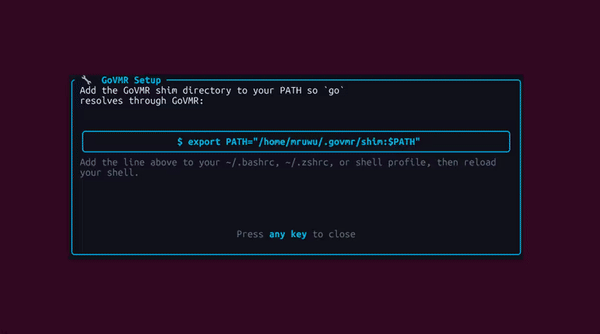
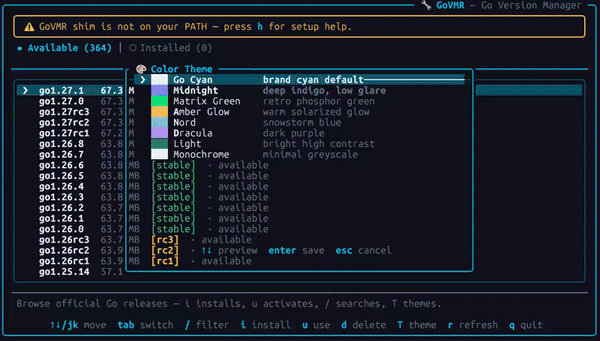
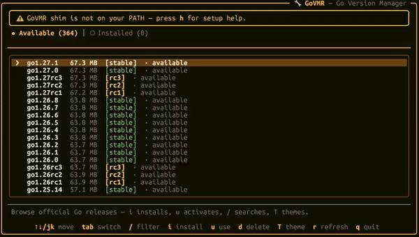

# GoVMR - Go Version Manager (Rust Edition)

> WIP - Current version is still a prototype


<br/>
A high-performance, asynchronous Go Version Manager written in Rust. GoVMR features a slick, interactive Terminal User
Interface (TUI) powered by Ratatui, as well as a full-featured Command Line Interface (CLI)
for scripting and automation.

## 🎬 Demo

Quick preview of key features:

- **Dashboard**: Browsing versions
- **Theme Picker**: Browse all 8 themes with live preview
- **Logs & Config**: Automatic logging and persistent settings

<details>

### 📦 Dashboard & Installation

_Browsing available versions_

<a href="docs/assets/dashboard_c.gif">
  
</a>

### Color Theme Picker

_Live preview of all 8 themes - arrows to browse, Enter to apply_

<a href="docs/assets/theme_c.gif">

</a>

### Logs and Config

_Automatic logging and persistent settings in ~/.govmr/_

<a href="docs/assets/logsandconfig_c.gif">

</a>

<sub>⚡ All demos are under 500KB for fast loading</sub>

</details>

## Features

- **Blazing Fast & Lightweight**: Zero external runtime dependencies; compiled directly to a standalone native binary.
- **Asynchronous Network & Streaming**: Concurrent downloads and in-memory archive extraction using Tokio, Reqwest,
  Flate2, and Tar/Zip.
- **Interactive TUI**: A modern Ratatui dashboard with:
    - **Live download progress modal** — animated gauge with percent, downloaded/total size, speed and ETA, followed by
      a dedicated "extracting" phase.
    - Live version search/filter, tab counts, archive sizes, and stable/rc badges.
    - Animated braille spinners for every background task (refresh, switch, delete, install).
    - Rounded-corners theme, branded header showing the active version, and an inline PATH-setup help overlay (`h`).
    - Keyboard navigation (vim keys + arrows).
- **Selectable color themes**: Eight built-in schemes — **Go Cyan** (default), **Midnight** (dark indigo), **Matrix
  Green**, **Amber Glow**, **Nord**, **Dracula**, **Light** (bright high-contrast), and **Monochrome**. Press `T` in the
  TUI to open a picker with a _live dashboard preview_ behind it (arrows/`jk` to move, number keys
  `1–8` for instant pick, `Enter` to save, `Esc` to cancel). Your choice is stored as TOML in
  `~/.govmr/config.toml` and reloaded on every launch — or set it from the CLI with `govmr theme <name>`. Change it
  again any time. (An old plain-text `~/.govmr/config` is migrated automatically.)
- **CLI progress bar**: `govmr install` shows a colored byte/speed/ETA bar that morphs into a spinner during extraction.
- **Smart version matching**: Prefixes are resolved with proper semver component boundaries (`govmr use 1.22`
  matches the latest `1.22.x`, never `1.2` or `1.220`); prerelease queries like `1.24rc1` require an exact pre-release
  match.
- **Non-Destructive Version Switching**: Uses executable shims (`~/.govmr/shim`) to instantly switch active versions
  without modifying global binary paths.
- **Cross-Platform**: Full support for Linux, macOS, and Windows.
- **Operation log**: every fetch/install/switch/delete/theme change is appended to
  `~/.govmr/govmr.log` (UTC timestamps, 1 MiB rotation) — your post-mortem trail when the TUI owns the screen and stdout
  is unusable.

---

## Installation

### Quick Install (Linux / macOS)

```bash
curl -fsSL https://raw.githubusercontent.com/seyallius/govmr/main/install.sh | bash
```

_To install a specific version:_

```bash
curl -fsSL https://raw.githubusercontent.com/seyallius/govmr/main/install.sh | bash -s v0.1.8
```

### Quick Install (Windows)

Open PowerShell and run:

```powershell
irm https://raw.githubusercontent.com/seyallius/govmr/main/install.ps1 | iex
```

_To install a specific version:_

```powershell
iex "& { $(irm https://raw.githubusercontent.com/seyallius/govmr/main/install.ps1) } -Version v0.1.8"
```

### Pre-built Binary (via Cargo Binstall)

```bash
# Install cargo-binstall first if you haven't
cargo install cargo-binstall

# Then install govmr instantly
cargo binstall govmr
```

### From crates.io (Compile from source)

```bash
cargo install govmr
```

### From Source

Ensure you have Rust and Cargo installed:

```bash
git clone https://github.com/seyallius/govmr.git
cd govmr
cargo install --path .
```

Move the compiled binary to your `PATH`:

```bash
# On Linux / macOS
sudo install -m 755 target/release/govmr /usr/local/bin/

# On Windows
copy target\release\govmr.exe C:\Windows\System32\
```

---

## Shell Configuration (First-Time Setup)

GoVMR uses executable shims located in `~/.govmr/shim`. Add this directory to your shell configuration so `go`
resolves through GoVMR. A guided setup screen appears automatically the first time you run the TUI, and you can re-open
it any time with `h`.

### Linux & macOS

Add the following to your `~/.bashrc`, `~/.zshrc`, or equivalent shell profile:

```bash
export PATH="$HOME/.govmr/shim:$PATH"
```

Reload your environment:

```bash
source ~/.bashrc  # or ~/.zshrc
```

### Windows (PowerShell)

Run the following script in PowerShell to safely add the shim to your permanent User PATH and your current session (avoids the 1024-character truncation bug of `setx`):

```powershell
$s = "$env:USERPROFILE\.govmr\shim"
$u = [Environment]::GetEnvironmentVariable("PATH", "User")
if ($u -notlike "*$s*") { [Environment]::SetEnvironmentVariable("PATH", "$u;$s", "User") }
if ($env:PATH -notlike "*$s*") { $env:PATH += ";$s" }
```

If you use CMD, you can add the path manually via **System Properties → Advanced → Environment Variables**. Restart your terminal session to apply changes.

---

## Usage

### Interactive TUI

Launch the full interactive TUI by executing `govmr` without subcommands:

```bash
govmr
```

#### Keybindings

| Key            | Action                                                                    |
|----------------|---------------------------------------------------------------------------|
| `↑` / `k`      | Move selection up                                                         |
| `↓` / `j`      | Move selection down                                                       |
| `Tab` / `t`    | Switch between **Available** and **Installed** views                      |
| `/`            | Open the live search/filter (type, then `Enter` to apply, `Esc` to clear) |
| `i`            | Download and install the selected version (shows the progress modal)      |
| `u`            | Switch the active Go version to the selected release                      |
| `d`            | Delete the selected installed version (asks for confirmation)             |
| `r`            | Refresh the remote version manifest from `go.dev`                         |
| `T`            | Open the color-theme picker (arrows to preview, `Enter` to save)          |
| `h` / `?`      | Open the PATH-setup help overlay                                          |
| `q` / `Ctrl+C` | Exit GoVMR                                                                |

### CLI Commands

```bash
# Install a specific or partial Go release (with a live download progress bar)
govmr install 1.22
govmr install 1.21.6

# Switch active Go version
govmr use 1.22

# List installed versions and show the current active version
govmr list

# Delete an installed Go release
govmr delete 1.21.6

# List available color themes / switch permanently
govmr theme
govmr theme midnight

# Show help options
govmr --help
```

---

## Architecture Overview

* **`src/manager.rs`**: Core orchestrator managing remote version manifests, asynchronous streaming (with
  `InstallProgress` events for download speed/ETA and extraction phase), decompression, and disk persistence.
* **`src/shim.rs`**: Manages shell wrappers inside `~/.govmr/shim` to forward execution to the currently active Go
  binary.
* **`src/tui/`**: Terminal UI — `views.rs` (dashboard, lists, modals, gauges, theme picker) and
  `setup.rs` (onboarding / help overlay) — via Ratatui.
* **`src/theme.rs`**: The eight color schemes; **`src/config.rs`** persists preferences to `~/.govmr/config.toml`.
* **`src/cli.rs`**: Subcommand definitions and execution pathways using Clap and Indicatif.

## Testing

Headless rendering tests draw every screen state (tabs, filter, install/extraction modals, delete confirmation, PATH
warning) into an in-memory buffer:

```bash
cargo test
```

## License

[MIT OR Apache-2.0](./LICENSE)
